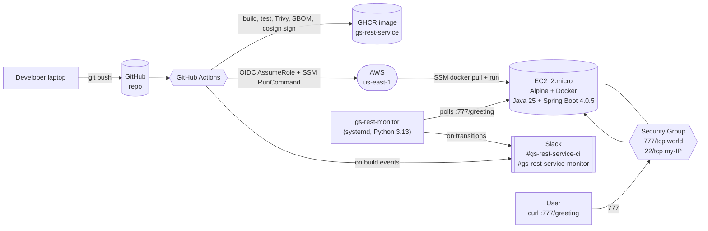

# bluegrid-devops-task

> Automated, signed, hardened build + deploy + monitoring for `gs-rest-service`
> on AWS Free Tier. Submission for the BlueGrid DevOps assessment.

[](.github/workflows/ci.yml)
[](.github/workflows/cd.yml)
[](.github/workflows/terraform.yml)

## Architecture



## What's in here

```
.
├── app/                       Spring Boot source (Java 25, Spring Boot 4.0.5)
├── Dockerfile                 3-stage: build → jlink minimal JRE → Alpine runtime (~166 MB)
├── .dockerignore
├── .hadolint.yaml             Hadolint config (warning threshold)
├── infra/                     Terraform: EC2, SG, IMDSv2, IAM OIDC role, SSM
│   ├── versions.tf            TF >=1.14, AWS ~>6.41, TLS ~>4.2, Random ~>3.8
│   ├── main.tf                Core resources
│   ├── iam_oidc.tf            GitHub OIDC + branch-scoped deploy role
│   └── userdata.sh.tftpl      Docker hardening, sshd, fail2ban, deploy user
├── evidence/                  Live proof captured from AWS (26 files, see evidence/README.md)
├── .github/
│   ├── workflows/
│   │   ├── ci.yml             Hadolint + Gitleaks + Maven + Trivy (CRITICAL gate) + Cosign + SBOM
│   │   ├── cd.yml             OIDC + SSM RunCommand deploy
│   │   └── terraform.yml      Static analysis ONLY (no plan/apply in CI)
│   ├── dependabot.yml
│   ├── CODEOWNERS
│   └── pull_request_template.md
├── scripts/
│   └── deploy.sh              Local fallback deploy (SSH path)
├── docs/
│   └── SEGMENT_B.md           AI integration strategy (B1-B6)
├── SECURITY.md                STRIDE threat model + controls + residual risks
├── RUNBOOK.md                 Operational procedures
├── COSTS.md                   Free Tier compliance evidence
├── CHAOS.md                   Kill-and-recover demo script
├── Makefile                   One-command ops
└── DevOps-Task.md             The original brief, transcribed
```

## Quick start

```bash
# 0. Prereqs on your laptop
#    - Docker Desktop, Terraform 1.14+, AWS CLI v2, Python 3.13, an SSH keypair
brew install terraform tflint checkov hadolint actionlint shellcheck

# 1. Build and smoke test the image locally
make build                     # Dockerfile -> gs-rest-service:dev
make run                       # :777/greeting reachable locally
curl http://localhost:777/greeting

# 2. Provision AWS
cp infra/terraform.tfvars.example infra/terraform.tfvars
$EDITOR infra/terraform.tfvars # set github_repo, admin_cidr (/32), ssh_public_key
make tf-plan                   # preview
make tf-apply                  # provision EC2 + IAM OIDC role

# 3. Configure GitHub repo
#    Repo variables: SLACK_NOTIFY=true, SLACK_CI_CHANNEL_ID, AWS_DEPLOY_ROLE_ARN,
#                    AWS_INSTANCE_ID, PUBLIC_SERVICE_URL
#    Repo secrets:   SLACK_BOT_TOKEN

# 4. Push. CI builds, scans, signs, pushes to GHCR, and CD deploys via SSM.
git push origin master

# 5. Install the monitor (from the other repo)
git clone https://github.com/amayabdaniel/gs-rest-monitor && cd gs-rest-monitor
sudo ./install.sh
```

## What the pipeline actually enforces

| Gate | Job | Fails build on |
|---|---|---|
| Dockerfile style | `hadolint` | any warning |
| Secrets | `gitleaks` | any match in full history |
| App tests | `mvn verify` | any failing test |
| Image CVEs | `trivy image --exit-code 1 --severity CRITICAL` | **any CRITICAL** |
| Supply chain | `cosign sign` + `cosign attest` (OIDC keyless) | signing or attestation failure |
| IaC style | `terraform fmt -check` | any unformatted file |
| IaC rules | `tflint --recursive`, `checkov` | any violation not explicitly justified |
| Workflows | `actionlint` locally | any syntax/expression error |

Everything third-party in `.github/workflows/*.yml` is **pinned to commit SHA**
(not tag) — a hard policy after the March 2026
`aquasecurity/trivy-action` supply-chain compromise.

## Why the image is 166 MB

- Multi-stage build (Maven + tests run in a throwaway stage).
- `jlink` builds a custom JRE with only the modules Spring Boot needs
  (about 65 MB vs the stock 200 MB+).
- `alpine:3.20` base (~5 MB).
- No shells or utilities in the runtime image beyond `tini`, `tzdata`, and
  `ca-certificates`.
- Runs as non-root UID 10001, read-only root filesystem, all capabilities
  dropped, `no-new-privileges`, memory and PID capped.

See `Dockerfile` comments for the full rationale.

## Deploy architecture (the senior move worth calling out on the defence call)

The CD pipeline has **zero static AWS credentials**:

- GitHub Actions assumes an IAM role via OIDC, with a trust policy scoped
  to `repo:OWNER/REPO:ref:refs/heads/master|develop`. Any other repo or
  branch is rejected at the IAM trust layer, not at the application layer.
- The assumed role's *only* permission is `ssm:SendCommand` on **one specific
  AWS document (`AWS-RunShellScript`) and one specific instance ID**.
- The deploy action is a single `aws ssm send-command` invoking
  `/usr/local/bin/gs-deploy.sh <image-ref>` as the `deploy` user.
- **The EC2 host never accepts SSH from GitHub.** SSH (port 22) is only open
  to your `/32`, for human ops fallback. The assessment still requires it;
  we don't use it in the pipeline.

## The two repos

Per the brief, the submission is split across two repositories:

| Repo | What's in it |
|---|---|
| [**amayabdaniel/bluegrid-devops-task**](https://github.com/amayabdaniel/bluegrid-devops-task) *(this one)* | App (`app/`), Dockerfile, Terraform IaC (`infra/`), GitHub Actions (CI + CD + Terraform static analysis), docs (Segment B, SECURITY, RUNBOOK, COSTS, CHAOS), and the live evidence bundle under `evidence/` |
| [**amayabdaniel/gs-rest-monitor**](https://github.com/amayabdaniel/gs-rest-monitor) | The monitoring tool as its own standalone Python package (Python 3.13, stdlib-only, own CI, own systemd unit). `pip install` from the repo root; `python -m gs_rest_monitor` or the `gs-rest-monitor` console script. |

Both invites go to `careers@bluegrid.io`.

## Trade-offs I'd revisit if this were production

See `SECURITY.md` §"Residual risks" and `COSTS.md` for the full table.

## License

Apache-2.0 for original code; upstream Spring sample is Apache-2.0.
