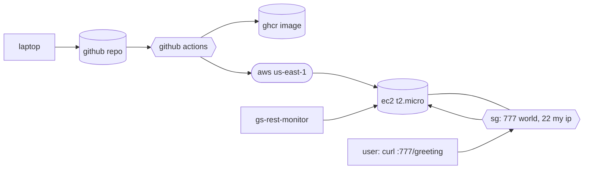

# bluegrid-devops-task

Build, deploy, and monitor `gs-rest-service` on AWS free tier. Submission for the BlueGrid DevOps assessment.

[](.github/workflows/ci.yml)
[](.github/workflows/cd.yml)
[](.github/workflows/terraform.yml)

## Architecture



## Layout

```
.
├── app/                       spring boot source (java 25, spring boot 4.0.5)
├── Dockerfile                 multi-stage, jlinked jre, alpine runtime (~166 mb)
├── .dockerignore
├── .hadolint.yaml
├── infra/                     terraform: ec2, sg, imdsv2, iam oidc role, ssm
│   ├── versions.tf
│   ├── main.tf
│   ├── iam_oidc.tf
│   └── userdata.sh.tftpl
├── evidence/                  live proof captured from aws
├── .github/
│   ├── workflows/
│   │   ├── ci.yml             hadolint + gitleaks + maven + trivy critical gate + cosign + sbom
│   │   ├── cd.yml             oidc + ssm runcommand deploy
│   │   └── terraform.yml      static analysis only
│   ├── dependabot.yml
│   ├── CODEOWNERS
│   └── pull_request_template.md
├── scripts/
│   └── deploy.sh              local fallback (ssh)
├── docs/
│   └── SEGMENT_B.md
├── SECURITY.md
├── RUNBOOK.md
├── COSTS.md
├── CHAOS.md
└── Makefile
```

## Quick start

```bash
# prereqs
brew install terraform tflint checkov hadolint actionlint shellcheck

# build + smoke test locally
make build
make run
curl http://localhost:777/greeting

# provision aws
cp infra/terraform.tfvars.example infra/terraform.tfvars
$EDITOR infra/terraform.tfvars  # github_repo, admin_cidr (/32), ssh_public_key
make tf-plan
make tf-apply

# github repo variables: SLACK_NOTIFY=true (if using slack), SLACK_CI_CHANNEL_ID,
#                        AWS_DEPLOY_ROLE_ARN, AWS_INSTANCE_ID, PUBLIC_SERVICE_URL
# github repo secrets:   SLACK_BOT_TOKEN

# push. ci builds, scans, signs, pushes to ghcr; cd deploys via ssm.
git push origin master

# install the monitor (from the other repo)
git clone https://github.com/amayabdaniel/gs-rest-monitor && cd gs-rest-monitor
sudo ./install.sh
```

## Pipeline gates

| gate | job | fails on |
|---|---|---|
| dockerfile style | hadolint | any warning |
| secrets | gitleaks | any match in full history |
| app tests | mvn verify | failing test |
| image cves | trivy image --exit-code 1 --severity CRITICAL | any critical |
| supply chain | cosign sign + cosign attest (oidc keyless) | signing failure |
| iac style | terraform fmt -check | any unformatted file |
| iac rules | tflint, checkov | any violation not explicitly skipped |
| workflows | actionlint | any syntax error |

Third-party actions are pinned to commit SHA (not tag). This is a hard policy after the March 2026 `aquasecurity/trivy-action` supply-chain compromise.

## Image size

- multi-stage build, tests run in a throwaway stage
- `jlink` custom jre (~65 mb vs stock ~200 mb)
- `alpine:3.20` base (~5 mb)
- runtime has only tini, tzdata, ca-certificates
- runs as uid 10001, read-only root fs, `--cap-drop=ALL`, `no-new-privileges`, memory + pid caps

## Deploy

No static aws credentials in ci:

- github actions assumes an iam role via oidc, trust scoped to `repo:OWNER/REPO:ref:refs/heads/master|develop`
- the role's only permission is `ssm:SendCommand` on one specific document (`AWS-RunShellScript`) and one specific instance id
- deploy step is `aws ssm send-command` calling `/usr/local/bin/gs-deploy.sh <image>` as the `deploy` user
- the ec2 host never accepts ssh from github. ssh (22) is open only to your /32 for human ops.

## Two repos

| repo | what's in it |
|---|---|
| [amayabdaniel/bluegrid-devops-task](https://github.com/amayabdaniel/bluegrid-devops-task) | app, dockerfile, terraform, ci/cd, docs, evidence |
| [amayabdaniel/gs-rest-monitor](https://github.com/amayabdaniel/gs-rest-monitor) | the monitor as its own python package (python 3.13, stdlib-only, own ci, own systemd unit) |

## License

Apache-2.0.
